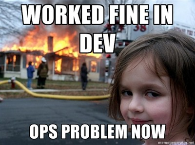
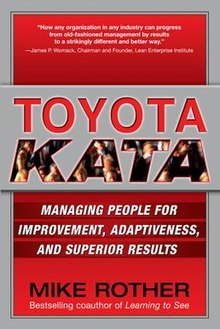
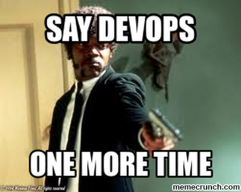
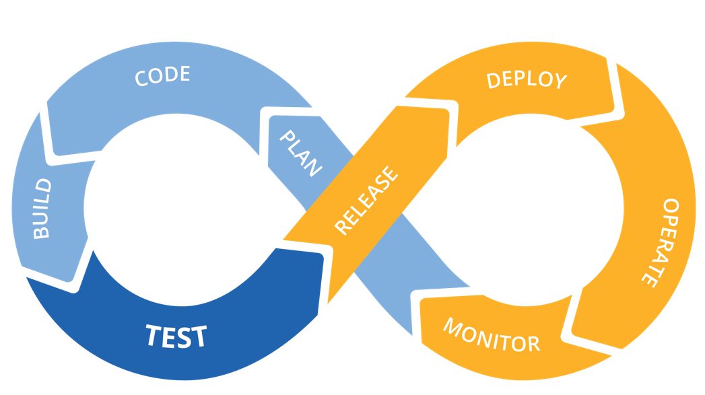

# DevOps

## Public Sector Platform Engineering

---?image=assets/img/darkages.jpg

## Background

+++

- Long lead times
- Not realising business value until complete
- no feedback until large releases

+++

---

"Our highest priority is to satisfy the customer through early and continuous delivery of valuable software" The Agile Manifesto

http://agilemanifesto.org/principles.html

+++
@snap[west]

@snapend
@snap[east]

@snapend

+++
@snap[north]

@snapend
@snap[south]
“Cease dependence on inspection to achieve quality. Eliminate the need for massive inspection by building quality into the product in the first place.”
@snapend
---

# DevOps?

+++

@ul

- @size[0.5em](“A cross-disciplinary community of practice dedicated to the study of building, evolving and operating rapidly-changing resilient systems at scale.”)

- @size[0.5em](“DevOps is the practice of operations and development engineers participating together in the entire service lifecycle, from design through the development process to production support.”)

- @size[0.5em](“DevOps is the combination of cultural philosophies, practices, and tools that increases an organization’s ability to deliver applications and services at high velocity: evolving and improving products at a faster pace than organizations using traditional software development and infrastructure management processes. This speed enables organizations to better serve their customers and compete more effectively in the market. ”)
@ulend

+++

---

# Benefits of DevOps

+++

## Speed

- Move at high velocity so you can innovate for customers faster.
- Adapt to changing markets better, and grow more efficient at driving business results.
-

note:
For example, micro services and continuous delivery let teams take ownership of services and then release updates to them quicker.
Empowers your developers and operations teams to achieve these results.

+++

## Rapid Delivery

- Increase the frequency and pace of releases so you can innovate and improve your product faster.
- The quicker you can release new features and fix bugs, the faster you can respond to your customers’ needs and build competitive advantage.
- Continuous integration and continuous delivery are practices that automate the software release process, from build to deploy.

+++

## Reliability

- Ensure the quality of application updates and infrastructure changes so you can reliably deliver at a more rapid pace while maintaining a positive experience for end users.
- Use practices like continuous integration and continuous delivery to test that each change is functional and safe.
- Monitoring and logging practices help you stay informed of performance in real-time.

+++

## Scale

- Operate and manage your infrastructure and development processes at scale.
- Automation and consistency help you manage complex or changing systems efficiently and with reduced risk.
- For example, infrastructure as code helps you manage your development, testing, and production environments in a repeatable and more efficient manner.

+++

## Improved Collaboration

- Build more effective teams under a DevOps cultural model, which emphasizes values such as ownership and accountability.
- Developers and operations teams collaborate closely, share many responsibilities, and combine their workflows.
- This reduces inefficiencies and saves time (e.g. reduced handover periods between developers and operations, writing code that takes into account the environment in which it is run).

+++

## Security

Move quickly while retaining control and preserving compliance. You can adopt a DevOps model without sacrificing security by using automated compliance policies, fine-grained controls, and configuration management techniques.

note:
For example, using infrastructure as code and policy as code, you can define and then track compliance at scale.

---

# Real world Experience...

+++?image=assets/img/experience.png&size=50% 100%

note:
We operate within all these organisations delivering DevOps capability
DevOps is a new term emerging from the collision of two major related trends. The first was also called “agile infrastructure” or “agile operations”; it sprang from applying Agile and Lean approaches to operations work.  The second is a much expanded understanding of the value of collaboration between development and operations staff throughout all stages of the development lifecycle when creating and operating a service

+++?image=assets/img/stack.png

+++

## Hypothesis Driven development

We Believe That increasing the size of hotel images on the booking page

Will Result In improved customer engagement and conversion

We Will Know We Have Succeeded When we see a 5% increase in customers who review hotel images who then proceed to book in 48 hours.

+++?image=assets/img/pipeline.png&size=60% 60%
@snap[north]
Pipeline
@snapend

note:

Under a DevOps model, development and operations teams are no longer “siloed.” Sometimes, these two teams are merged into a single team where the engineers work across the entire application lifecycle, from development and test to deployment to operations, and develop a range of skills not limited to a single function.

In some DevOps models, quality assurance and security teams may also become more tightly integrated with development and operations and throughout the application lifecycle. When security is the focus of everyone on a DevOps team, this is sometimes referred to as DevSecOps.
These teams use practices to automate processes that historically have been manual and slow. They use a technology stack and tooling which help them operate and evolve applications quickly and reliably. These tools also help engineers independently accomplish tasks (for example, deploying code or provisioning infrastructure) that normally would have required help from other teams, and this further increases a team’s velocity.

---

# DevOps Practice

+++

## Continuous Integration

Continuous integration is a software development practice where developers regularly merge their code changes into a central repository, after which automated builds and tests are run. The key goals of continuous integration are to find and address bugs quicker, improve software quality, and reduce the time it takes to validate and release new software updates.

+++

## Continuous Delivery

Continuous delivery is a software development practice where code changes are automatically built, tested, and prepared for a release to production. It expands upon continuous integration by deploying all code changes to a testing environment and/or a production environment after the build stage. When continuous delivery is implemented properly, developers will always have a deployment-ready build artifact that has passed through a standardized test process.

+++

## Microservices

- @size[0.5em](The microservices architecture is a design approach to build a single application as a set of small services.)
- @size[0.5em](Each service runs in its own process and communicates with other services through a well-defined interface using a lightweight mechanism, typically an HTTP-based application programming interface API.)
- @size[0.5em](Microservices are built around business capabilities; each service is scoped to a single purpose. You can use different frameworks or programming languages to write microservices and deploy them independently, as a single service, or as a group of services.)

+++?image=assets/images/github.png&size=cover&opacity=20

 
## Infrastructure as Code
 

Infrastructure as code is a practice in which infrastructure is provisioned and managed using code and software development techniques, such as version control and continuous integration. The cloud’s API-driven model enables developers and system administrators to interact with infrastructure programmatically.

note:
and at scale, instead of needing to manually set up and configure resources. Thus, engineers can interface with infrastructure using code-based tools and treat infrastructure in a manner similar to how they treat application code. Because they are defined by code, infrastructure and servers can quickly be deployed using standardized patterns, updated with the latest patches and versions, or duplicated in repeatable ways.

@snap[west]

@snapend

### Configuration Management

Developers and system administrators use code to automate operating system and host configuration, operational tasks, and more. The use of code makes configuration changes repeatable and standardized. It frees developers and systems administrators from manually configuring operating systems, system applications, or server software.

+++?code=src/terraform/main.tf&title=Source: Terraform File

+++

### Policy as Code

With infrastructure and its configuration codified with the cloud, organisations can monitor and enforce compliance dynamically and at scale. Infrastructure that is described by code can thus be tracked, validated, and reconfigured in an automated way.

note:
This makes it easier for organisations to govern changes over resources and ensure that security measures are properly enforced in a distributed manner (e.g. information security or compliance with PCI-DSS or HIPAA). This allows teams within an organisation to move at higher velocity since non-compliant resources can be automatically flagged for further investigation or even automatically brought back into compliance.

+++

## Monitoring and Logging

- Organisations monitor metrics and logs to see how application and infrastructure performance impacts the experience of their product’s end user.
- capturing, categorising, and then analysing data and logs generated by applications and infrastructure, organisations understand how changes or updates impact users, shedding insights into the root causes of problems or unexpected changes.

note:
Active monitoring becomes increasingly important as services must be available 24/7 and as application and infrastructure update frequency increases. Creating alerts or performing real-time analysis of this data also helps organisations more proactively monitor their services.

+++

## Communication and Collaboration

- @size[0.5em](Increased communication and collaboration in an organisation is one of the key cultural aspects of DevOps.)
- @size[0.5em](The use of DevOps tooling and automation of the software delivery process establishes collaboration by physically bringing together the workflows and responsibilities of development and operations.)
- @size[0.5em](Building on top of that, these teams set strong cultural norms around information sharing and facilitating communication through the use of chat applications, issue or project tracking systems, and wikis.)

note:
This helps speed up communication across developers, operations, and even other teams like marketing or sales, allowing all parts of the organisation to align more closely on goals and projects.

---

